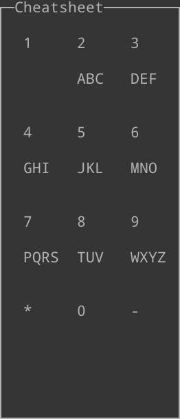

# Noko
A Linux desktop environment for mobile devices with a [3x4 number key](https://en.wikipedia.org/wiki/Telephone_keypad) matrix. This is to be used for opening & managing apps.

The web demo of the desktop environment is available at [foxmoss.github.io/noko/](https://foxmoss.github.io/noko/), this does not support standard desktop apps as it wouldn't be feasible to port X11 and your traditional desktop apps to WASM without significant overhead.

## Controls

### Typing

For typing in search it is [T9](https://en.wikipedia.org/wiki/T9_%28predictive_text%29) based where one letter corresponds to one number. See the cheatsheet below:

So to type "Settings" would be "73884647".

### Options

| Key | Usage |
| -------------- | --------------- |
| `+` | Close Window |
| `-` | Delete |
| `Enter` | Open app in search |
| `1-9` | Open app in the home screen |

## Credits
- Followed [this blog post](https://jichu4n.com/posts/how-x-window-managers-work-and-how-to-write-one-part-ii/) as a tutorial for X11
- Used [clay](https://github.com/nicbarker/clay/) as a layout engine.
